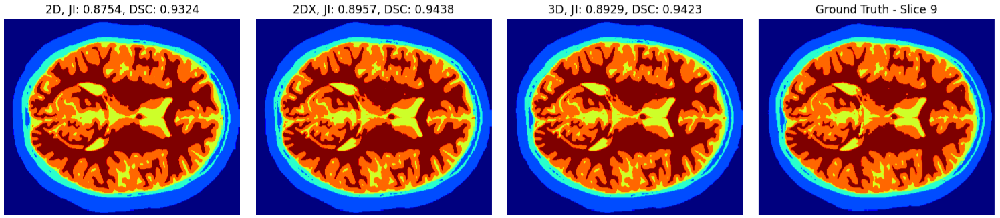

# Brain-MRI-Segmentation
Part of the Computer Vision Module

### Project Overview
This project focuses on the segmentation of brain MRI tissue using a combination of boundary-based and region-based segmentation techniques. These methods help identify and analyze different brain tissue types from T1-weighted brain MRI images, which are essential for detecting abnormalities, monitoring disease progression, and other medical analyses.

### Implementation
* 2D Segmentation: Applies various techniques on individual 2D slices to enhance the visibility of different tissues.
* 3D Segmentation: Extends the 2D segmentation approach to accommodate 3D volumetric data, providing more comprehensive analysis and segmentation accuracy.
  
### Evaluation Metrics
* Jaccard Score: Used to evaluate the overlap between the predicted segmentation and the ground truth.
* Dice Coefficient: Provides a statistical validation of the segmentation accuracy by measuring the similarity between two sets.
  
### Results
Comparison between different algorithms implemented.

### Libraries and Tools
* NumPy
* SciPy
* Scikit-Image
* Matplotlib
* Scikit-Learn
